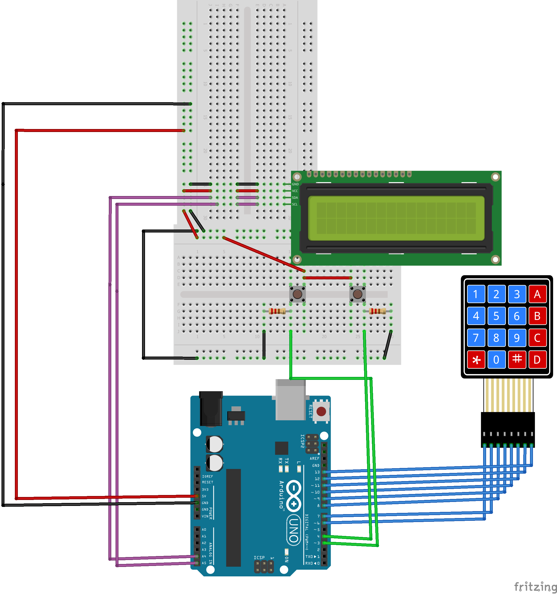

# Casio-Style Arduino Calculator

## Overview

A memory-safe, OOP-based Arduino calculator featuring continuous floating-point math and a classic Casio-style dual-row LCD interface.

This project utilizes strict C++ Object-Oriented Programming (OOP) principles to completely decouple hardware management from the core mathematical state machine, preventing the spaghetti code common in standard Arduino projects.

## Circuit Schematic

## Hardware Requirements

* **Microcontroller:** Arduino Uno (or compatible)
* **Display:** 16x2 LCD with I2C Backpack (Address `0x27`)
* **Input:** 4x4 Membrane Keypad
* **Scrolling Controls:** 2x Tactile Push Buttons (with pull-down resistors)

## System Architecture

The codebase is divided into modular classes to prevent hardware-specific code from polluting the mathematical logic.

### 1. `KeyPadManager`

* **Role:** Hardware abstraction for the 4x4 matrix keypad.
* **Details:** Encapsulates the row/column pin definitions and the character map. Provides a single public method (`get_pressed_key()`) to securely pass inputs to the main loop.

### 2. `LCDManager`

* **Role:** Display driver and visual buffer manager.
* **Details:** Manages the 16x2 I2C LCD. It implements a dual-buffer system (`topBuffer` and `bottomBuffer`) to prevent visual artifacting and ghosting.
* **Features:**
* Safely truncates strings to prevent memory overflow.
* Auto-aligns the result string to the bottom right of the screen (Casio-style layout).
* Clears trailing ghost characters using padded spacing.
* Supports horizontal scrolling for equations exceeding 16 characters.

### 3. `Utils` (Namespace)

* **Role:** Free-standing utility functions.
* **Details:** Houses global helper functions like `is_sign()`. Placed in a namespace to prevent global scope pollution while maintaining independence from the calculator's internal state.

### 4. `Calculator`

* **Role:** The core state machine and math engine.
* **Details:** Evaluates keypresses, manages the timeline of user inputs, and executes floating-point arithmetic.

#### State Machine Logic

The calculator uses a highly resilient state machine relying on boolean flags to track the timeline of an equation, preventing crashes from unexpected user behavior:

* `number1Defined`: Tracks if the first operand is locked in memory.
* `number2Started`: Prevents computation if a user changes their mind about an operator (e.g., pressing `+` then immediately pressing `-`).
* **Continuous Math:** Automatically shifts the `result` into `number1Buffer` upon computation, allowing infinite chaining of operations.
* **Auto-Clear:** Detects if a digit is pressed immediately after an equals (`=`) operation, safely wiping the memory to start a fresh equation.
* **Decimal Safety:** Scans the active buffer to prevent multiple decimal points (e.g., rejecting `5.5.5`).
